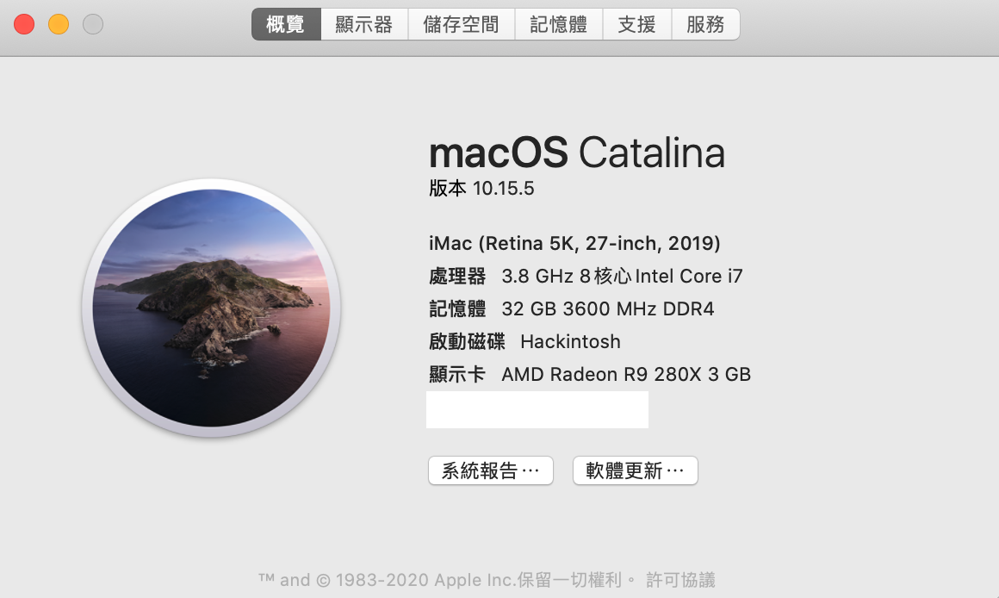

# 10700k-Gigabyte-Z490-Vision-g

## Based on
    https://github.com/samuel21119/Intel-i9-10900-Gigabyte-Z490-Vision-G-Hackintosh

## Hardware
- i7 10700k
- R9 280X
- 32GB ram
- Fenvi T919
## Working
- 2.5Gb Ethernet
- Wifi/BT
- Audio
- Reboot and Shutdown
- UHD 630 
- R9 280X
## Not working 
- Motherboard HDMI port (DP port is working)

## Details

### UHD 630 
    <key>PciRoot(0x0)/Pci(0x2,0x0)</key>
    <dict>
        <key>AAPL,ig-platform-id</key>
        <data>BwCbPg==</data>
        <key>device-id</key>
        <data>mz4AAA==</data>
        <key>framebuffer-patch-enable</key>
        <data>AQAAAA==</data>
        <key>framebuffer-stolenmem</key>
        <data>AAAAQA==</data>
    </dict>

### Don't forget to set PlatformInfo

#### Ensure Facetime iMessage can work 
    https://dortania.github.io/OpenCore-Desktop-Guide/config.plist/comet-lake.html#platforminfo

### BIOS

#### Disable
- Fast Boot
- CSM
- Intel SGX
- Secure Boot

#### Enable
- EHCI/XHCI Hand-off
- Above 4G decoding
- EHCI/XHCI Hand-off
- OS type : other

### CFG set 

[CFG-Lock read Step 7](https://www.tonymacx86.com/threads/gigabyte-z490-vision-d-thunderbolt-3-i5-10400-amd-rx-580.298642/)
## Credits
https://github.com/SchmockLord/Hackintosh-Intel-i9-10900k-Gigabyte-Z490-Vision-D

https://github.com/samuel21119/Intel-i9-10900-Gigabyte-Z490-Vision-G-Hackintosh

https://dortania.github.io/OpenCore-Desktop-Guide/

https://www.tonymacx86.com/threads/gigabyte-z490-vision-d-thunderbolt-3-i5-10400-amd-rx-580.298642/