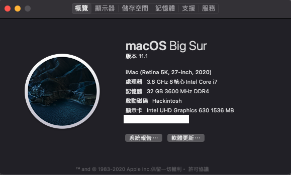

# 10700k-Gigabyte-Z490-Vision-g

# Update Big Sur

### OC version 0.6.5
## Hardware
- i7 10700k
- GIGABYTE Z490 VISION G 
- R9 280X (optional)
- 32GB ram
- Fenvi T919
## Working
- 2.5Gb Ethernet
- Wifi/BT
- Audio
- Reboot and Shutdown
- UHD 630 
- R9 280X 
- Onboard HDMI/DP port
## Not working 
- ~~Motherboard HDMI port (DP port is working)~~
  

Install the latest WhateverGreen,Lilu and add Framebuffer Patching  
[Framebuffer Patching GUIDE](https://www.tonymacx86.com/threads/guide-general-framebuffer-patching-guide-hdmi-black-screen-problem.269149/)
## Details

#### Update Bios version to F6.
#### Disable CFG Lock in bios menu

### Set PlatformInfo (Facetime iMessage need it)

    https://dortania.github.io/OpenCore-Install-Guide/config.plist/comet-lake.html#platforminfo

### UHD 630 
#### Framebuffer Patching
#### Thank [@augstb](https://github.com/georgetree/hackintosh-10700k-Gigabyte-Z490-Vision-g/issues/3#issuecomment-785422044) for fixing sleep HDMI unplug/replug

    <dict>
        <key>AAPL,ig-platform-id</key>
        <data>BwCbPg==</data>
        <key>device-id</key>
        <data>mz4AAA==</data>
        <key>framebuffer-stolenmem</key>
        <data>AAAwAQ==</data>
        <key>framebuffer-fbmem</key>
        <data>AACQAA==</data>
        <key>framebuffer-con1-busid</key>
        <data>BAAAAA==</data>
        <key>framebuffer-con1-enable</key>
        <data>AQAAAA==</data>
        <key>framebuffer-con1-flags</key>
        <data>zwMAAA==</data>
        <key>framebuffer-con1-index</key>
        <data>AwAAAA==</data>
        <key>framebuffer-con1-pipe</key>
        <data>CAAAAA==</data>
        <key>framebuffer-con1-type</key>
        <data>AAgAAA==</data>
        <key>framebuffer-con2-busid</key>
        <data>AQAAAA==</data>
        <key>framebuffer-con2-enable</key>
        <data>AQAAAA==</data>
        <key>framebuffer-con2-index</key>
        <data>AgAAAA==</data>
        <key>framebuffer-con2-type</key>
        <data>AAQAAA==</data>
        <key>framebuffer-con2-flags</key>
        <data>xwMAAA==</data>
        <key>framebuffer-con2-pipe</key>
        <data>CgAAAA==</data>
        <key>framebuffer-con0-busid</key>
        <data>BQAAAA==</data>
        <key>framebuffer-con0-enable</key>
        <data>AQAAAA==</data>
        <key>framebuffer-con0-flags</key>
        <data>xwMAAA==</data>
        <key>framebuffer-con0-index</key>
        <data>AQAAAA==</data>
        <key>framebuffer-con0-pipe</key>
        <data>CQAAAA==</data>
        <key>framebuffer-con0-type</key>
        <data>AAQAAA==</data>
        <key>framebuffer-patch-enable</key>
        <data>AQAAAA==</data>
        <key>model</key>
        <string>Intel UHD Graphics 630</string>
    </dict>
 
#### 4k resolution 
#### If you use 4k display, you can refer [this link](https://github.com/georgetree/hackintosh-10700k-Gigabyte-Z490-Vision-g/issues/3)  

### BIOS

#### Disable
- Fast Boot
- CSM
- Intel SGX
- Secure Boot
- CFG Lock
#### Enable
- EHCI/XHCI Hand-off
- Above 4G decoding
- OS type : other

## Credits
https://github.com/SchmockLord/Hackintosh-Intel-i9-10900k-Gigabyte-Z490-Vision-D

https://github.com/samuel21119/Intel-i9-10900-Gigabyte-Z490-Vision-G-Hackintosh

https://dortania.github.io/OpenCore-Desktop-Guide/

https://www.tonymacx86.com/threads/gigabyte-z490-vision-d-thunderbolt-3-i5-10400-amd-rx-580.298642/
